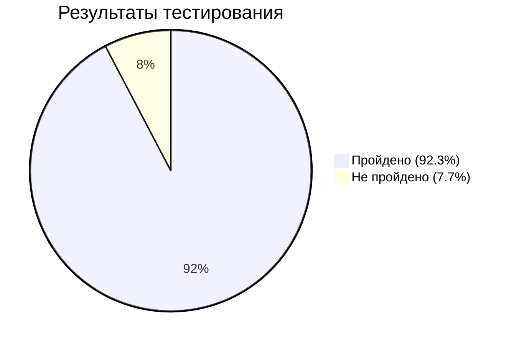

# Отчёт по итогам тестирования

**Дата:** 30.08.2026  
**Версия:** 1.0

---

## 1. Краткое описание

Проведено автоматизированное тестирование веб-сервиса "Путешествие дня", который предлагает покупку тура двумя способами:

- Обычная оплата по дебетовой карте (Debit)
- Выдача кредита по данным банковской карты (Credit)

Сервис взаимодействует с СУБД (MySQL) и эмулятором банковских сервисов (Gate Simulator). Тестирование проводилось с использованием:

- UI-тесты (Selenide)
- Проверки БД (JDBC)
- Отчёты Allure и Gradle

---

## 2. Количество тест-кейсов

Всего автоматизировано **26 тест-кейсов**:

| Категория | Количество |
|-----------|------------|
| Позитивные сценарии (Debit) | 1 |
| Позитивные сценарии (Credit) | 1 |
| Негативные сценарии (Debit) | 1 |
| Негативные сценарии (Credit) | 1 |
| Валидация формы (Debit) | 8 |
| Валидация формы (Credit) | 8 |
| Проверки БД | 2 |
| **Итого** | **26** |

---

## 3. Процент успешных и неуспешных тест-кейсов

| Показатель | Значение |
|------------|----------|
| Всего тестов | 26 |
| Пройдено успешно | 24 (92.3%) |
| Не пройдено | 2 (7.7%) |

---

## 4. Описание найденных багов

| № | Описание | Серьезность | Статус |
|---|----------|-------------|--------|
| #1 | PostgreSQL: таблицы не создаются автоматически | Critical | Открыт |
| #2 | При DECLINED отображается сообщение "Успешно! Операция одобрена Банком" | Major | Открыт |
| #3 | При пустом CVC ошибка отображается у поля "Владелец" | Minor | Открыт |

### Баг #1: PostgreSQL таблицы не создаются

**Описание:** При запуске SUT с PostgreSQL таблицы в базе данных не создаются автоматически.

**Шаги воспроизведения:**
1. Запустить SUT с PostgreSQL:
   `java -jar aqa-shop.jar -P:jdbc.url=jdbc:postgresql://localhost:5432/app -P:jdbc.user=app -P:jdbc.password=pass`
2. Подключиться к БД PostgreSQL
3. Выполнить запрос: `SELECT * FROM payment_entity`

**Фактический результат:** Ошибка: relation "payment_entity" does not exist

**Ожидаемый результат:** Таблицы создаются автоматически

---

### Баг #2: Неправильное сообщение при DECLINED

**Описание:** При использовании DECLINED карты (4444 4444 4444 4442) для обоих способов оплаты (Debit и Credit) отображается успешное уведомление вместо ошибки.

**Шаги воспроизведения:**

**Для Debit (оплата по карте):**
1. Нажать кнопку "Купить"
2. Заполнить поле "Номер карты": 4444 4444 4444 4442
3. Заполнить остальные поля валидными значениями
4. Нажать "Продолжить"

**Для Credit (кредит):**
1. Нажать кнопку "Купить в кредит"
2. Заполнить поле "Номер карты": 4444 4444 4444 4442
3. Заполнить остальные поля валидными значениями
4. Нажать "Продолжить"

**Фактический результат:** В обоих случаях отображается уведомление "Успешно! Операция одобрена Банком"

**Ожидаемый результат:** В обоих случаях должно отображаться уведомление "Ошибка! Банк отказал в проведении операции"

**Дополнительная информация:**
- В БД статус сохраняется корректно — `DECLINED`
- Проблема только в отображении сообщения пользователю
- Баг воспроизводится как для Debit, так и для Credit способов оплаты

---

### Баг #3: Ошибка валидации CVC

**Описание:** При пустом поле CVC сообщение об ошибке отображается у поля "Владелец" вместо поля "CVC/CVV".

**Шаги воспроизведения:**
1. Нажать кнопку "Купить" или "Купить в кредит"
2. Поле "CVC/CVV" оставить пустым
3. Заполнить остальные поля валидными значениями
4. Нажать "Продолжить"

**Фактический результат:** У поля "Владелец" появляется сообщение "Поле обязательно для заполнения"

**Ожидаемый результат:** У поля "CVC/CVV" появляется сообщение "Неверный формат"

---

## 5. Общие рекомендации

1. **Исправить баг с PostgreSQL** — добавить автоматическое создание таблиц при запуске SUT.

2. **Исправить баг с DECLINED** — настроить корректное отображение сообщения об ошибке при отказе банка.

3. **Исправить баг с CVC** — настроить валидацию таким образом, чтобы сообщение об ошибке отображалось у соответствующего поля.

4. **Подключить CI (опционально)** — для автоматического запуска тестов при каждом изменении кода.

5. **Расширить покрытие** — добавить тесты для проверки корректности данных в БД при всех сценариях.

6. **Обновить документацию** — после исправления багов обновить README.md и другую документацию.

---

## 6. Интегрированные отчёты

В систему автоматизации интегрированы следующие отчёты:

| Отчёт | Команда для генерации |
|-------|----------------------|
| **Gradle** | `./gradlew test` |
| **Allure** | `./gradlew allureReport` или `./gradlew allureServe` |

Allure отчет включает:
- Скриншоты упавших тестов
- Page Source для анализа
- Шаги выполнения тестов
- Статистику по тестам

---

## 7. Заключение

Автоматизированное тестирование выполнено на **92.3%**. Все основные сценарии покрыты автотестами. Найдены и зафиксированы 3 бага приложения, из которых 2 критических (PostgreSQL и DECLINED) и 1 незначительный (CVC).

Тесты готовы к использованию в процессе разработки и регрессионного тестирования.